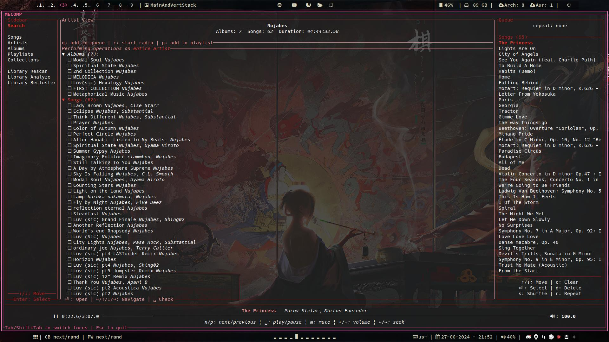

# Metadata Enhanced Collection Oriented Music Player (MECOMP)

<!-- markdownlint-disable MD033 -->

[](https://wakatime.com/badge/github/AnthonyMichaelTDM/mecomp)
[](https://codecov.io/gh/AnthonyMichaelTDM/mecomp)
[](https://github.com/AnthonyMichaelTDM/mecomp/actions/workflows/ci.yml)
[](http://hits.dwyl.com/AnthonyMichaelTDM/mecomp)
[](https://github.com/AnthonyMichaelTDM/mecomp/actions/workflows/cd.yml)

(name subject to change)

## Introduction

MECOMP is a local music player that it is designed to solve a very specific problem:

> I have a large collection of music, organizing my music by artist and album is not enough, I want to be able to organize my music by other criteria, such as genre, mood, etc.
> Typically, I would have to create a playlist for each of these criteria, but that is tedious and time consuming.
> I want to have automatically curated playlists of similar songs (analogous to genres), dynamically updated playlists of songs that match a certain criteria (basically filters), and be able to create queues of songs that are similar to the current song (think Pandora).
> There are some services that let you do most of these, like Spotify, but I want to be able to do this with my *local* music collection and not have to rely on a third party service.

## Installation

<details>
<summary>Aside: Linux Dependencies</summary>

On linux, you will need to have the following packages installed:

`libasound2-dev` `pkg-config` `wget` `libavutil-dev` `libavformat-dev`

```sh
# debian/ubuntu
sudo apt-get install libasound2-dev pkg-config wget libavutil-dev libavformat-dev
# Arch (btw)
sudo pacman -S alsa-lib pkg-config wget ffmpeg
```

</details>

### Compiling from Source

MECOMP is written in rust, so you will need to have the rust toolchain installed, you can find installation instructions [here](https://www.rust-lang.org/tools/install).

then clone the repository and compile the project, we provide an `x.sh` script that will compile the binaries for you:

```sh
git clone https://github.com/AnthonyMichaelTDM/mecomp.git
cd mecomp
./x.sh b # or `cargo build --release --bins` if you don't want to use the script
```

this will compile the project and place the binaries in the `target/release` directory.

### Using CD Builds

As part of the CI/CD pipeline, we provide pre-compiled binaries for the latest commits on the `main` branch.
You can find these by navigating to the [actions tab](https://github.com/AnthonyMichaelTDM/mecomp/actions/workflows/cd.yml) and downloading the artifacts for the latest successful build.

The artifacts you'll want to download are dependent on your platform:

<details>
<summary>x86_64 Windows</summary>

- `mecomp-cli-Windows-x86_64`
- `mecomp-daemon-Windows-x86_64`
- `mecomp-tui-Windows-x86_64`

</details>

<details>
<summary>arm Windows</summary>

- `mecomp-cli-Windows-aarch64`
- `mecomp-daemon-Windows-aarch64`
- `mecomp-tui-Windows-aarch64`

</details>

<details>
<summary>arm (Apple Silicon) Mac</summary>

- `mecomp-cli-macOs-aarch64`
- `mecomp-daemon-macOs-aarch64`
- `mecomp-tui-macOs-aarch64`

</details>

<details>
<summary>x86_64 (intel) Mac</summary>

- `mecomp-cli-macOs-x86_64`
- `mecomp-daemon-macOs-x86_64`
- `mecomp-tui-macOs-x86_64`

</details>

<details>
<summary>x86_64 Linux</summary>

- `mecomp-cli-Linux-x86_64`
- `mecomp-daemon-Linux-x86_64`
- `mecomp-tui-Linux-x86_64`

</details>

Other platforms are not currently supported, but you can try compiling the binaries from source.

### Releases

Precompiled binaries for the latest releases can be found on the [releases page](https://github.com/AnthonyMichaelTDM/mecomp/releases).
Checksums for the binaries are attached to the release notes.

### Crates.io

MECOMP is published on crates.io, you can install the binaries by running:

```sh
cargo install mecomp-daemon mecomp-cli mecomp-tui
```

## Usage

> Note: the following commands assume the MECOMP binaries are either in your `PATH` or in the current directory.
>
> If you compiled the binaries from source, you can `cd` into the `target/release` directory and run the commands from there.

MECOMP is composed of a daemon and several clients that communicate with the daemon, the daemon is the core of the application and handles all the backend logic and state-management necessary for the application to function, the clients are simply frontends to this server.

Before you can use MECOMP, you will need to start the daemon, you can do this by running the daemon binary:

```sh
./mecomp-daemon
```

this will start the daemon, which will listen for RPC requests on `localhost:6600` by default (the same port that [MPD](https://www.musicpd.org/) uses).

Once the daemon starts, it will create a configuration file in the "mecomp" directory in your user's configuration directory:

- `C:\Users\username\AppData\Roaming\mecomp` on windows
- `$HOME/Library/Application Support/mecomp` on mac
- `$XDG_CONFIG_HOME/mecomp` on linux

You can use this file to configure things such as the root directory of your music collection, the port the daemon listens on, etc.

Once you have things configured to your liking, you'll have to restart the daemon for the changes to take effect.

Then, you'll have to tell the daemon to start scanning and analysing your music collection, you can do this (in a separate terminal) by running:

```sh
# Tell the daemon to start scanning your music collection
./mecomp-cli library rescan
# before moving on, wait for the daemon to finish scanning your music collection
# it will tell you in the logs when it's done, but you can also check the status by running
./mecomp-cli status rescan

# once the daemon has finished scanning your music collection, you can tell it to start analysing your music collection
./mecomp-cli library analyse
# again, wait for the daemon to finish analysing your music collection, it will tell you in the logs when it's done,
# and you can check the status by running
./mecomp-cli status analyse

# once the daemon has finished analysing your music collection, you can tell it to start clustering your music collection
./mecomp-cli library recluster
# again, wait for the daemon to finish clustering your music collection, it will tell you in the logs when it's done,
# and you can check the status by running
./mecomp-cli status recluster
```

Each of these commands will take some time to complete.

Once the daemon is up and running and has finished scanning, analysing, and clustering your music collection, you can use the clients to interact with the daemon, the current most "user-friendly" client is the TUI, you can start the TUI by running:

```sh
./mecomp-tui
```

this will start the TUI in your console, which will allow you to interact with the daemon.

### Adding Music

To add music to the app, simply put the music files into one of the directories configured in the daemon's configuration file, then tell the daemon to rescan your music collection. By default, this includes your users Music directory, but you can add more directories by editing the configuration file.

#### Aside: How do I get music?

You can get music from a variety of sources, such as:

- ripping CDs
- purchasing/downloading music from an artist's website
- purchasing/downloading music from bandcamp, soundcloud, etc.
- downloading music from youtube
- etc.

For example, you can use a tool like [yt-dlp](https://github.com/yt-dlp/yt-dlp) to download music from youtube music

```sh
# example, downloads a playlist from YouTube Music, and converts it to mp3
yt-dlp --extract-audio --audio-format mp3 --yes-playlist --embed-thumbnail --embed-metadata --concurrent-fragments 4 -o '%(title)s.%(ext)s' <playlist-url>
```

(replace `<playlist-url>` with the url of the playlist you want to download)

you can then use an audio tagger such as [MusicBrainz Picard](https://picard.musicbrainz.org/) to tag the music files with missing metadata.

## Architecture

MECOMP is designed to be modular and extensible, and is composed of a daemon (which is the core of the application), and several clients that communicate with the daemon.

### MECOMP-Daemon

MECOMP-Daemon is a long-running RPC server that is the core of the application, it handles all the backend logic and state-management necessary for the application to function. the MECOMP clients are simply frontends to this server. It is written in rust and uses google's [tarpc](https://github.com/google/tarpc) library for inter-process communication via RPC.

### Clients

#### MECOMP-CLI

MECOMP-CLI is a command line interface for MECOMP, it provides a simple way to interact with the daemon.

#### MECOMP-TUI

MECOMP-TUI is a terminal user interface for MECOMP, it provides a more user friendly way to interact with the daemon, but still in a terminal.



#### MECOMP-GUI

MECOMP-GUI is a graphical user interface for MECOMP, it provides a more user friendly way to interact with the daemon.

the GUI is not currently implemented, but is planned for the future.

## Have a question or need help?

If you have a question or need help, feel free ask in the [discussions](https://github.com/AnthonyMichaelTDM/mecomp/discussions) section of the repository.

If you encounter a bug or have a feature request, please open an issue in the [issues](https://github.com/AnthonyMichaelTDM/mecomp/issues) section of the repository.

Note about bugs: if you encounter a bug, please provide as much information as possible, including the steps to reproduce the bug, the expected behavior, the actual behavior, and any error messages you see, without this information it will be very difficult to diagnose and fix the bug.

## Features

- [x] Scan music collection from a directory (and it's subdirectories)
- [ ] handle song and album art properly
- [x] maintain a persistent state of the music collection (henceforth referred to as "Library" or "Music Library") that allows users to create playlists, track play counts, "like" songs, etc.
  - [x] rescan endpoint: updates the library while minimizing data loss (i.e. play counts, likes, playlists, etc. should be preserved as much as possible)
    - used when adding a new root directory to the music collection, or when there have been changes to the collection while the daemon was not running
  - [x] music library watcher that dynamically updates the library when songs are added, removed, or modified as long as the daemon is running
- [x] allow users to create playlists
- [x] allow users to search their music library (search for songs, artists, albums, etc.)
  - [x] searching by songs includes the artist names in the index, so for example searching for "Green Day" will return all songs by Green Day (even if the song name doesn't contain "Green Day")
- [ ] allow users to "like" songs
- [ ] track play counts
- [ ] allow users to create "smart playlists" that are automatically updated based on a set of criteria (e.g. "all songs with a play count greater than 10", "all songs by Green Day", "all songs with a similarity to Foo greater than X", etc.)
  - [ ] these criteria should be able to be combined with set/boolean logic (union (AND), intersection (OR), difference (NOT))
  - [ ] criteria can be scoped to allow for more complex queries
- [x] maintains multiple auto-curated "Collections" created by K-Means clustering on the Music Library, these collections will represent the broad themes within your music collection, but are not tied to human defined genres
  - I'm not sure how best to name these collections, may be "genres", "moods", "styles", etc. I'm not sure if these should be user editable or not, but I'm leaning towards not.
  - These collections are generated when the Music Library is scanned and will be updated when the Music Library is rescanned
  - [x] Users can "freeze" a collection, which will convert it to a playlist
- [x] allow users to start a "radio" based on a specific song, artist, or album, which will suggest songs similar to that input.
  - [x] uses M-Tree index based nearest neighbor search to find similar songs. This is a fast approximate nearest neighbor search algorithm that is well suited for high dimensional data (like audio features)
  - [x] audio features are extracted by methods inspired by [bliss-rs](https://github.com/Polochon-street/bliss-rs), these are the same features we use for clustering
  - [x] supported at the daemon level
  - [x] functionality to populate the queue with those suggestions
- [x] suggest songs to add to a playlist based on the current playlist (the average of the audio features of the songs in the playlist)
  - [x] supported at the daemon level
  - [x] supported by the CLI
  - [x] supported by the TUI
- [ ] if a song is missing important metadata, and there is an internet connection, attempt to fetch the metadata from the [MusicBrainz API](https://musicbrainz.org/doc/MusicBrainz_API).
- [x] properly handle compilation albums (i.e. albums with multiple artists)
  - do this by simply showing the album multiple times, once for each artist. This is how iTunes handles it, and I think it's the best way to do it.
- [x] properly handle songs with multiple artists (i.e. collaborations) (this is different from compilation albums)
  - mark the song as being by multiple artists, but only show it for the artist(s) that are identified by the "album artist" tag in the metadata (if it exists)\
- [x] properly handle songs with multiple genres (i.e. "Rock; Metal")
  - show the song for each genre

## Tracings

> Note: this section is only relevant if you are a developer working on MECOMP.

### OpenTelemetry

MECOMP uses open-telemetry for tracing, and is designed to integrate with a jaeger instance for distributed tracing.

this can be enabled by enabling the `otel_tracing` feature.

```sh
cargo run --features otel_tracing
```

#### Jaeger

to run a jaeger instance, you can use the official docker image, for convenience there is a script that will run a jaeger instance in a docker container:

```sh
./scripts/start_jaeger_container.sh
```

### Flame Graph

to create a flame graph of the daemon, compile it with the `flame` feature enabled, and run the daemon as you normally would.

```sh
cargo run --features flame
```

this will create a file called `tracing.folded` in the current directory, which can be used to create a flame graph with [inferno](https://github.com/jonhoo/inferno):

```sh
cargo install inferno
```

then run:

```sh
# flamegraph
cat tracing.folded | inferno-flamegraph > tracing-flamegraph.svg

# flamechart
cat tracing.folded | inferno-flamegraph --flamechart > tracing-flamechart.svg
```

## Testing

MECOMP uses [`cargo-nextest`](https://nexte.st/) for testing (`cargo test` will work too, but is slower), to run the test suite:

```sh
cargo nextest run
```

## Test Coverage

[](https://codecov.io/gh/AnthonyMichaelTDM/mecomp)

MECOMP uses `tarpaulin` to generate test coverage reports, to generate a test coverage report, run:

```sh
cargo coverage
```

this will generate a file called `tarpaulin-report.html` in the current directory, which can be viewed in your browser.

[](https://codecov.io/gh/AnthonyMichaelTDM/mecomp)

## Git Hooks

MECOMP uses several git hooks to ensure code quality, these are stored in the `.githooks` directory, to install these hooks, run:

```sh
git config core.hooksPath .githooks
```
