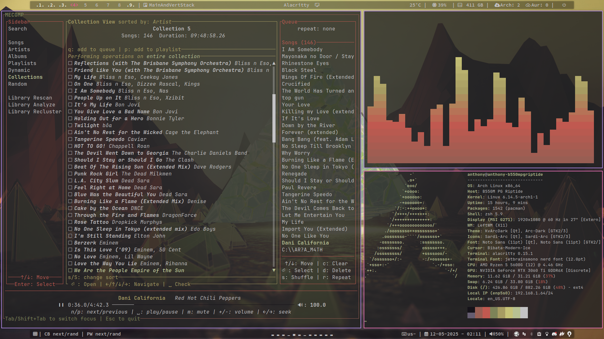

# Examples

This directory contains example configs for various things you can do with mecomp.

## Zellij layout for mecomp

`mecomp.kdl` - a Zellij layout config that starts a terminal with the mecomp Daemon, TUI, and MPRIS server.

to use, copy it to your Zellij config directory (`~/.config/zellij/layouts/`). Then you can use it by running `zellij -l mecomp`

## Pywal template for mecomp

`colors-Mecomp.toml` - pywal template for mecomp.
  
to use, add it to your pywal template directory (`~/.cache/wal/templates/`), and run pywal. Then create a symlink to the generated colors file in your mecomp config directory (`ln -rs ~/.cache/wal/colors-Mecomp.toml ~/.config/mecomp/Mecomp.toml`).

