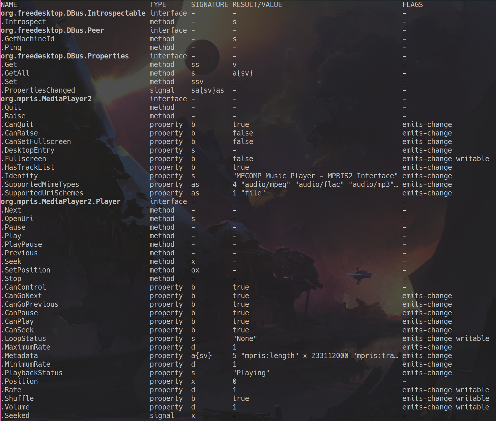

# MECOMP MPRIS

This is a simple MPRIS server that can be used to control the MECOMP Daemon from any MPRIS client.

Not all of MECOMP's features are available through MPRIS, but the most important ones are.

For reference, here are the links to the MPRIS specifications I aim to implement:

This library supports all the following interfaces as defined in the specification:

- [org.mpris.MediaPlayer2](https://specifications.freedesktop.org/mpris-spec/latest/Media_Player.html)
- [org.mpris.MediaPlayer2.Player](https://specifications.freedesktop.org/mpris-spec/latest/Player_Interface.html)
- [org.mpris.MediaPlayer2.TrackList](https://specifications.freedesktop.org/mpris-spec/latest/Track_List_Interface.html)
- [org.mpris.MediaPlayer2.Playlists](https://specifications.freedesktop.org/mpris-spec/latest/Playlists_Interface.html)

